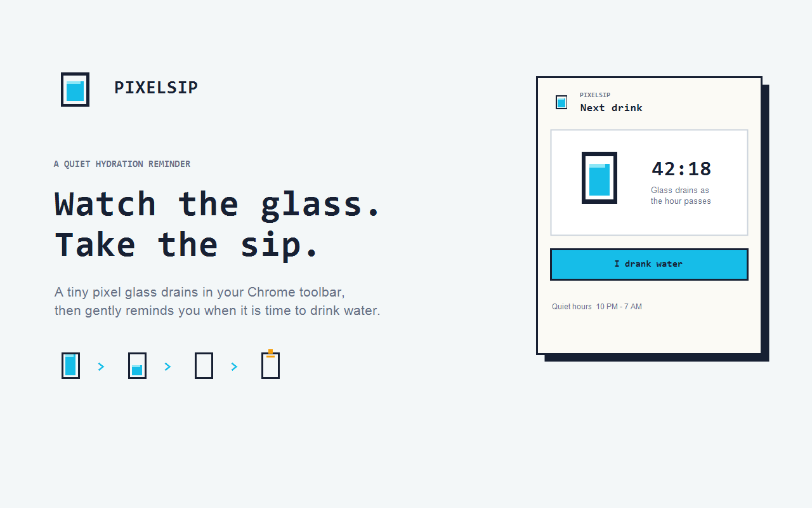

# PixelSip

PixelSip is a focused Chrome extension that turns its toolbar icon into a visible hydration timer.

The pixel glass drains over one hour. When it becomes empty, PixelSip shakes the icon, plays a short sound, and sends a desktop notification. The next hour begins only after the user confirms **I drank water**.



## Why PixelSip

Most reminder tools disappear behind menus or become easy to ignore. PixelSip keeps the reminder visible in the Chrome toolbar without demanding attention until the timer finishes.

- Visible progress without opening the popup
- One clear purpose: remind the user to drink water
- No accounts, analytics, advertisements, or hydration history
- Quiet hours that freeze and later resume the remaining timer
- Pixel-style interface designed to stay readable at toolbar size

## Install locally

1. Download or clone this repository.
2. Open `chrome://extensions`.
3. Enable **Developer mode**.
4. Click **Load unpacked**.
5. Select the `extension` folder.
6. Pin PixelSip from Chrome's extensions menu.

## Repository structure

```text
extension/       Chrome extension runtime source
assets/          Store screenshots and promotional artwork
docs/            Product, use-case, technical, privacy, and release documentation
scripts/         Store asset and ZIP packaging helpers
tests/           Focused state and package-contract tests
index.html       Public GitHub Pages privacy-policy page
```

## Documentation

- [Product design](docs/PRODUCT_DESIGN.md)
- [Use cases](docs/USE_CASES.md)
- [Technical design](docs/TECHNICAL_DESIGN.md)
- [Privacy](docs/PRIVACY.md)
- [Testing](docs/TESTING.md)
- [Chrome Web Store release guide](docs/CHROME_WEB_STORE.md)
- [Contributing](CONTRIBUTING.md)
- [Security](SECURITY.md)
- [Changelog](CHANGELOG.md)

## Test

```powershell
node tests\state.test.js
node tests\popup-contract.test.js
node --check extension\service-worker.js
node --check extension\popup.js
node --check extension\offscreen.js
```

## Privacy

PixelSip stores timer state and quiet-hour preferences locally. It does not collect or transmit user data.

Public policy: [https://pv-vimalnair.github.io/PixelSip/](https://pv-vimalnair.github.io/PixelSip/)

## License

[MIT](LICENSE)
