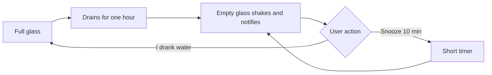

# Product Design

## Product idea

PixelSip makes elapsed time visible through a tiny glass of water in the Chrome toolbar. The icon begins full and drains downward over one hour. Once empty, it becomes an active reminder instead of silently starting another timer. Its reminder sound repeats until the user responds, with volume controlled by the user.

## Design principles

### Visible, not intrusive

The toolbar glass communicates progress passively. Sound, shaking, and notification are reserved for the moment a drink is due.

### Confirmation over assumption

PixelSip does not assume a notification means the user drank water. The empty-glass state waits until the user selects **I drank water**.

### One purpose

The extension does not track water consumption, calculate goals, create accounts, or build streaks. Its narrow purpose is an hourly hydration reminder.

### Readable at tiny sizes

The glass uses a dark rectangular outline, bright cyan water, and discrete fill levels. These remain legible in Chrome's small toolbar-icon slot.

## Visual language

- **Direction:** Pixel Utility
- **Primary ink:** dark navy
- **Water:** cyan with a pale highlight
- **Alert accent:** amber
- **Surface:** warm off-white
- **Typography:** monospace-first, with readable system text for supporting copy
- **Geometry:** squared forms, restrained four-pixel radii, visible pixel grid

## Interaction states

| State | Toolbar icon | Popup behavior |
|---|---|---|
| Running | Glass drains in steps | Shows remaining time and confirmation button |
| Awaiting confirmation | Empty glass shakes with amber alert and looping sound | Waits for **I drank water** or snooze |
| Snoozed | Partially filled glass for ten-minute timer | Returns to running state |
| Paused | Muted glass | Offers resume |
| Quiet hours | Muted glass with sleep pixels | Freezes remaining time and resumes later |

## Core flow

## Accessibility considerations

- Text controls remain clearly labeled.
- Timer status is exposed through visible text rather than icon color alone.
- Alert state combines motion, sound, icon state, and system notification.
- Controls retain strong contrast against the off-white popup.
- Quiet hours reduce unwanted nighttime interruption.
- Reminder volume can be reduced or muted at any time.

## Future product considerations

Potential paid or expanded capabilities should preserve the core's simplicity. Reasonable future directions include custom intervals, alternate pixel-glass themes, device synchronization, and team wellness deployments. Hydration history or medical claims should not be introduced casually because they would materially change privacy and product scope.
