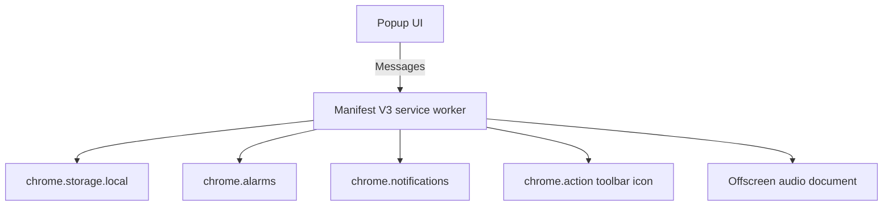

# Technical Design

## Platform

PixelSip is a Chrome Manifest V3 extension with no backend and no external runtime dependencies.

## Architecture

## Runtime components

### Service worker

`extension/service-worker.js` owns the durable reminder state and Chrome API integration.

Responsibilities:

- Initialize and reconcile reminder state
- Schedule the next reminder or quiet-hours boundary
- Pause and resume timers
- Handle confirmation and snooze actions
- Redraw the toolbar glass using `OffscreenCanvas`
- Shake the icon at reminder time
- Create notifications
- Request sound playback from the offscreen document
- Stop the looping sound after confirmation or snooze

### Popup

`extension/popup.html`, `popup.css`, and `popup.js` provide the Pixel Utility interface.

The popup reads state through runtime messages and exposes:

- Remaining time
- **I drank water**
- Pause and resume
- Quiet-hour settings
- Reminder-volume control

### Offscreen audio

`extension/offscreen.html` and `offscreen.js` play the packaged reminder sound on a loop. Manifest V3 service workers cannot directly use normal page audio APIs, so Chrome's offscreen document API is used only for audio playback. The service worker sends play, stop, and live volume-update messages to this document.

## State model

State is stored under `pixelSipState` in `chrome.storage.local`.

| Field | Purpose |
|---|---|
| `status` | `running`, `awaiting`, `paused`, or `quiet` |
| `intervalMinutes` | Reminder interval, currently 60 |
| `nextReminderAt` | Absolute timestamp for active timer |
| `remainingMs` | Frozen duration for pause and quiet states |
| `quietEnabled` | Whether quiet hours apply |
| `quietStart` / `quietEnd` | Local-time quiet-hour boundaries |
| `quietUntil` | Current quiet period's ending timestamp |
| `volume` | Local reminder volume from `0` (muted) to `1` |

## Quiet-hours behavior

Quiet hours freeze rather than reset the timer:

1. At quiet-hours start, remaining time is calculated and saved.
2. The active reminder alarm is replaced with an alarm for quiet-hours end.
3. At quiet-hours end, a new reminder timestamp is calculated from the saved remaining duration.

The implementation supports quiet windows that cross midnight.

## Permissions

| Permission | Reason |
|---|---|
| `alarms` | Schedule reminder and quiet-hour boundaries |
| `notifications` | Show the drink-water reminder and actions |
| `offscreen` | Play the packaged reminder sound locally |
| `storage` | Persist timer state and quiet-hour preferences locally |

PixelSip requests no host permissions and cannot read website content or browsing history.

## Security and privacy

- No remote code
- No backend
- No analytics
- No host permissions
- No account or authentication data
- No user-data transmission

## Packaging

Only extension runtime files belong in the Chrome Web Store ZIP. Documentation, tests, screenshots, and packaging scripts remain in the repository but are excluded from the upload package.

`scripts/Build-Icons.ps1` generates every static icon from the shared 16-pixel
glass design. The service worker reproduces the same pixel coordinates when it
draws the live draining toolbar icon.
